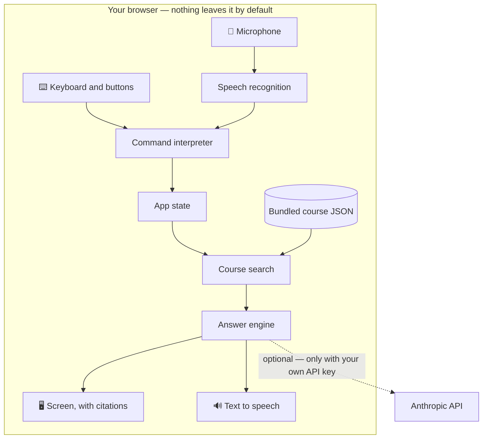
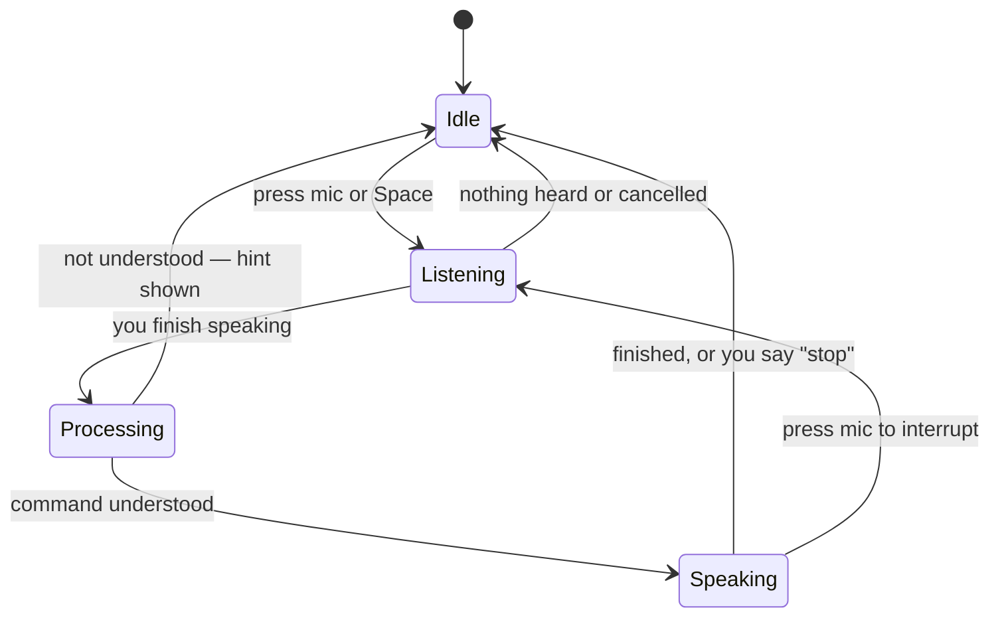
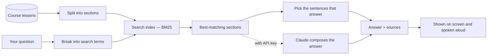

# 🎙 Voice-First Learning

**Learn hands-free.** A voice-driven, screen-reader-friendly way to study course content:
ask questions out loud and hear answers taken straight from the course, review flashcards
by voice, and have
lessons read to you — with every single feature equally usable by keyboard and mouse.

[](https://github.com/jjsanda/voice-first_accessible_learning_interface/actions/workflows/ci.yml)
[](https://github.com/jjsanda/voice-first_accessible_learning_interface/actions/workflows/deploy.yml)
[](LICENSE)
[](docs/ACCESSIBILITY.md)
[](CONTRIBUTING.md)

**[▶ Try it live](https://jjsanda.github.io/voice-first_accessible_learning_interface/)** — no
install, no account, no API key needed.

<!--
  docs/media/hero.gif goes here once recorded — see docs/media/README.md for
  exactly what to capture (the voice Q&A flow works best as a hero).
-->

## Why this exists

Studying usually means eyes on a screen and hands on a keyboard. That doesn't work when
you're walking to class, cooking dinner, or resting your eyes — and it doesn't work at all
for many learners with visual impairments or motor disabilities. This project explores a
different default: **voice as a first-class way to learn**, with a fully equivalent visual
and keyboard experience, so nobody is locked out either way.

## What it does

- **🗣 Ask anything about the course** — speak (or type) a question like _"How do hash
  tables handle collisions?"_ and get an answer assembled from the actual course text,
  read aloud and shown on screen **with sources you can jump to**.
- **🃏 Voice-driven flashcards** — _"flip"_, _"I got it right"_, _"no idea"_, _"next"_.
  A spaced-repetition scheduler brings back the cards you miss sooner and the cards you
  know later.
- **📖 Lessons read aloud** — _"read lesson three"_ or _"read the lesson about sorting"_,
  then _"pause"_, _"continue"_, _"next section"_. The reader follows along visually.
- **⌨️ 100 % usable without voice** — every voice command has an equivalent button or key.
  Voice is an option, never a requirement.
- **🤖 Optional AI answers** — add your own Anthropic API key in Settings and answers are
  composed conversationally by Claude, still grounded in the course excerpts. Without a
  key the app works entirely in your browser, quoting answers directly from the course.
- **📚 Bring your own course** — the demo ships with a CS fundamentals course, but any
  course is just a JSON file. See [docs/COURSE_FORMAT.md](docs/COURSE_FORMAT.md).

Everything runs **in your browser**. There is no server, no account, and no tracking;
by default nothing you say or study ever leaves your device (see the
[privacy notes](#privacy) below for the two exceptions).

## Quick start

```bash
git clone https://github.com/jjsanda/voice-first_accessible_learning_interface.git
cd voice-first_accessible_learning_interface
npm install
npm run dev
```

Open the printed URL, allow microphone access when asked, and try saying
**"go to the quiz"**.

### Browser support

| Feature                                          | Chrome / Edge | Safari     | Firefox |
| ------------------------------------------------ | ------------- | ---------- | ------- |
| Voice input (speech recognition)                 | ✅            | ⚠️ partial | ❌      |
| Read aloud (speech synthesis)                    | ✅            | ✅         | ✅      |
| Everything else (keyboard, mouse, screen reader) | ✅            | ✅         | ✅      |

Where voice input isn't available, the app says so and the text input takes over — no
feature is lost, only the microphone.

## How it works

Three pictures instead of a thousand words. Everything below happens inside your browser.

### The big picture



### Talking to the app

The microphone is push-to-talk (press the mic button or <kbd>Space</kbd>), so the app
never listens while it speaks and never records in the background.



### From question to grounded answer

Answers are never invented: the app searches the course text and quotes (or, with an API
key, lets Claude rephrase) only what it actually found — always with a source. If the
course doesn't cover something, it says so honestly.



Details for the curious: [docs/ARCHITECTURE.md](docs/ARCHITECTURE.md).

## Voice commands

| You say                                                  | What happens                 | Works in           |
| -------------------------------------------------------- | ---------------------------- | ------------------ |
| _"go to lessons / quiz / questions / home / settings"_   | Navigate                     | everywhere         |
| _"ask …"_ or just speak a question                       | Grounded answer with sources | everywhere / Ask   |
| _"read lesson three"_, _"read the lesson about sorting"_ | Lesson read aloud            | Lessons, Home      |
| _"next section"_ / _"previous section"_                  | Move through a lesson        | Lessons            |
| _"flip"_, _"show the answer"_                            | Reveal the flashcard         | Quiz               |
| _"right"_, _"I knew it"_ / _"wrong"_, _"no idea"_        | Grade the card               | Quiz               |
| _"next"_ / _"skip"_                                      | Next card                    | Quiz               |
| _"repeat"_, _"say that again"_                           | Hear it again                | Ask, Lessons, Quiz |
| _"pause"_ / _"continue"_ / _"stop"_                      | Control speech               | everywhere         |
| _"help"_, _"what can I say"_                             | Show all commands            | everywhere         |

Keyboard: <kbd>Space</kbd> talk · <kbd>Esc</kbd> stop speech · <kbd>?</kbd> commands ·
<kbd>Tab</kbd>/<kbd>Enter</kbd> everything else.

## Accessibility

Accessibility is the point of this project, not a checkbox. The target is **WCAG 2.2 AA**:

- Full keyboard operability with visible focus, a skip link, and logical landmarks.
- Screen-reader announcements for every state change via live regions; every spoken
  message has a visual twin, every visual control has a spoken path.
- High-contrast light & dark themes, `prefers-reduced-motion` and Windows High Contrast
  (forced colors) support, 44 px touch targets, 18 px base text.
- Accessibility linting (`eslint-plugin-jsx-a11y`) runs in CI on every push to `main` and
  every pull request.

The full statement — including what has and hasn't been tested, and known limitations —
lives in [docs/ACCESSIBILITY.md](docs/ACCESSIBILITY.md). If you use a screen reader,
your feedback would be genuinely valuable — please [open an issue](https://github.com/jjsanda/voice-first_accessible_learning_interface/issues).

## Privacy

Everything — course content, search, answers, quiz progress, settings — stays in your
browser. Two things to know:

1. **Voice input**: Chromium browsers implement speech recognition as a cloud service, so
   while the mic is active your audio is processed by the browser vendor (e.g. Google).
   The mic is push-to-talk only and its state is always visible.
2. **Optional AI answers**: if (and only if) you add an Anthropic API key, your question
   plus the few matched course excerpts are sent directly from your browser to Anthropic.
   The key is stored in your browser's local storage and sent nowhere else.

## Bring your own course

A course is one JSON file: lessons with sections of plain prose, plus flashcards.

```json
{
  "id": "my-course",
  "title": "My Course",
  "description": "One or two sentences about the course.",
  "language": "en",
  "version": "1.0.0",
  "lessons": [
    {
      "id": "intro",
      "title": "Introduction",
      "order": 1,
      "summary": "What this course covers.",
      "sections": [
        { "id": "welcome", "title": "Welcome", "content": "Plain prose that reads well aloud." }
      ]
    }
  ],
  "flashcards": [
    {
      "id": "fc-1",
      "lessonId": "intro",
      "front": "A natural spoken question?",
      "back": "A short spoken answer."
    }
  ]
}
```

The authoring guide — including how to write content that sounds good through a speaker
and matches spoken questions — is in [docs/COURSE_FORMAT.md](docs/COURSE_FORMAT.md).

## Project structure

```
src/
├── course/      Course loading + validation, bundled demo course (JSON)
├── retrieval/   Tokenizer, section chunker, BM25 search index — no dependencies
├── answer/      Answer engines: extractive (default) and Claude (optional), with fallback
├── commands/    Voice grammar, transcript normalization, parser, command router
├── speech/      Web Speech API wrappers (recognition + synthesis) and React hooks
├── srs/         Leitner spaced-repetition scheduler + progress persistence
├── state/       App store, hash router, settings
├── components/  UI building blocks (VoiceHud, Flashcard, LessonReader, …)
└── views/       Home, Ask, Lessons, Quiz, Settings
```

The domain core — `retrieval`, `srs`, `course`, the command grammar and the extractive
answer engine — is pure TypeScript with no React imports, which is why it has thorough
unit tests. React enters only at the boundary (hooks, components, views), and the one
runtime dependency beyond React (the Anthropic SDK) is isolated behind a lazy import.

## Tech stack

React 19 · TypeScript (strict) · Vite · Web Speech API · Vitest + Testing Library ·
zero runtime dependencies beyond React (the Anthropic SDK loads on demand, only if you
add a key).

## Development

```bash
npm run dev        # start the dev server
npm test           # run the test suite (130+ tests)
npm run lint       # ESLint incl. accessibility rules
npm run typecheck  # strict TypeScript
npm run build      # production build
```

CI runs all of the above on every push to `main` and every pull request; `main` deploys
automatically to GitHub Pages.

## Roadmap

- Course library: load courses from a URL or local file at runtime
- Wake-word / hands-free continuous mode (opt-in)
- Smarter scheduling (full SM-2) and per-lesson progress stats
- PWA install for fully offline study
- More languages for both content and voice commands

## Contributing

Bug reports, accessibility feedback, course content and code are all welcome — see
[CONTRIBUTING.md](CONTRIBUTING.md).

## License

[Apache License 2.0](LICENSE) © 2026 [Josef Sanda](https://github.com/jjsanda)
